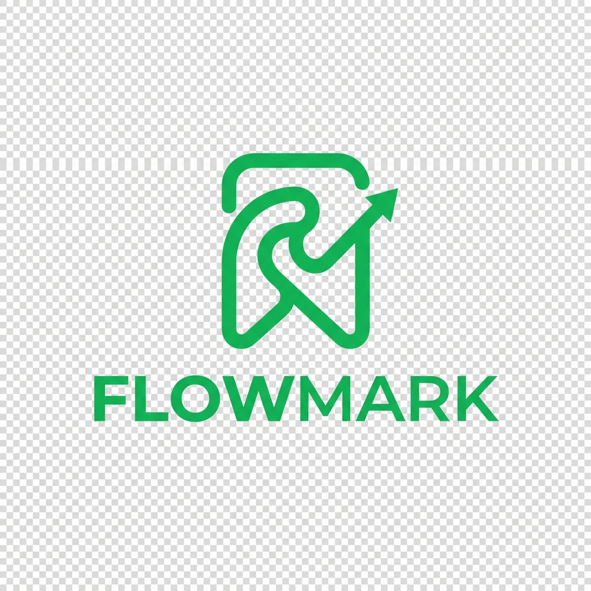

<div align="center">
  
  <h1>FlowMark</h1>
  <p><strong>Organize Your Bookmarks Like Never Before</strong></p>
  
  [](https://vercel.com/new/clone?repository-url=https%3A%2F%2Fgithub.com%2FNOOBGLITCH%2Fthebookmarkapp)
</div>

<br />

**FlowMark** is a modern, privacy-first bookmark manager designed to help you save, organize, and rediscover your favorite links. With intelligent auto-tagging and a beautiful interface, it transforms your chaotic browser bookmarks into a curated knowledge base.

## 🚀 Features

- **⚡ Instant Metadata**: Automatically fetches titles, descriptions, and previews using a custom extraction engine.
- **🏷️ Smart Auto-Tagging**: Uses rule-based logic to automatically categorize links (e.g., "Dev", "News", "Design") without sending data to external AI APIs.
- **📷 Live Screenshots**: Generates visual previews of your bookmarks automatically.
- **🔒 Privacy-Focused**: Your data lives in your Supabase database. No tracking, no external data selling.
- **📂 Deep Organization**: Create nested folders and use multiple tags for flexible organization.
- **🔍 Full-Text Search**: Find any bookmark instantly by title, URL, or tag.
- **📱 PWA Support**: Install as an app on your phone or desktop for offline access.
- **🤝 Sharing**: Create public links to share curated folders or lists with friends.

---

## 🛠️ Tech Stack

Built with modern, high-performance technologies:

- **Frontend**: [React](https://react.dev/), [Vite](https://vitejs.dev/)
- **Styling**: [TailwindCSS](https://tailwindcss.com/)
- **Backend & Auth**: [Supabase](https://supabase.com/) (PostgreSQL)
- **State Management**: React Context API
- **Deployment**: [Vercel](https://vercel.com/)

---

## 📦 Getting Started

### Prerequisites
- Node.js 18+
- A Supabase account (Free tier is sufficient)

### Installation

1.  **Clone the repository:**
    ```bash
    git clone https://github.com/NOOBGLITCH/thebookmarkapp.git
    cd thebookmarkapp
    ```

2.  **Install dependencies:**
    ```bash
    npm install
    ```

3.  **Environment Setup:**
    Create a `.env` file in the root directory:
    ```env
    VITE_SUPABASE_URL=https://your-project.supabase.co
    VITE_SUPABASE_ANON_KEY=your-anon-key
    ```

4.  **Run Development Server:**
    ```bash
    npm run dev
    ```
    Open `http://localhost:5173` to see the app.

---

## 🚀 Deployment

The easiest way to deploy is with **Vercel**.

1.  Push your code to GitHub.
2.  Import the project into Vercel.
3.  Add your Environment Variables in the Vercel Dashboard.
4.  **Important**: Update your **Supabase Auth Redirect URLs** and **Google Cloud Console** authorized origins to match your new Vercel domain.

---

## 📜 License

MIT License &copy; 2026 FlowMark.
